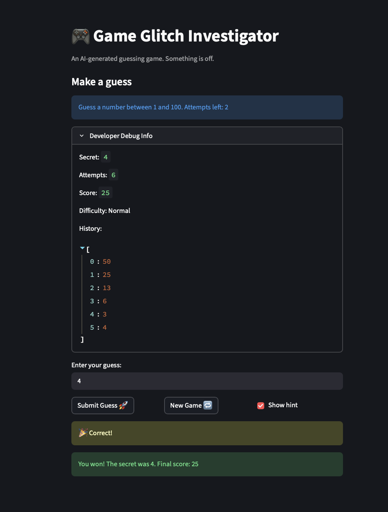

# 🎮 Game Glitch Investigator: The Impossible Guesser

## 🚨 The Situation

You asked an AI to build a simple "Number Guessing Game" using Streamlit.
It wrote the code, ran away, and now the game is unplayable. 

- You can't win.
- The hints lie to you.
- The secret number seems to have commitment issues.

## 🛠️ Setup

1. Install dependencies: `pip install -r requirements.txt`
2. Run the broken app: `python -m streamlit run app.py`

## 🕵️‍♂️ Your Mission

1. **Play the game.** Open the "Developer Debug Info" tab in the app to see the secret number. Try to win.
2. **Find the State Bug.** Why does the secret number change every time you click "Submit"? Ask ChatGPT: *"How do I keep a variable from resetting in Streamlit when I click a button?"*
3. **Fix the Logic.** The hints ("Higher/Lower") are wrong. Fix them.
4. **Refactor & Test.** - Move the logic into `logic_utils.py`.
   - Run `pytest` in your terminal.
   - Keep fixing until all tests pass!

## 📝 Document Your Experience

- [] Describe the game's purpose.
- [ 

   1. SOLVED The Hints are reversed 
   2. SOLVED If i am chnaging the difficulty midgame then the attempts are not resetting 
   3. SOLVED Number of attempts are one less than what it should be 
   4. SOLVED The new game button isnt working as its supposed to, i had to refresh it, status not reset 
   5. SOLVED Submit guess button is glitchy, had to click twice to submit a guess but it still counted two attempts for one input as you can see from the history, hint not displayed correctly 
   6. SOLVED Incorrect guess was also being shown as correct, example if i used float 100.1 and the target was 100, it gave me a correct on this which is wrong
   7. SOLVED It is storing history or displaying history incorrectly not immediately history not reset on new game
   8. SOLVED The range isnt changing according to the difficulty

] Detail which bugs you found.

- [ 

   

] Explain what fixes you applied.

## 📸 Demo

## 🚀 Stretch Features

- [ ] [If you choose to complete Challenge 4, insert a screenshot of your Enhanced Game UI here]
